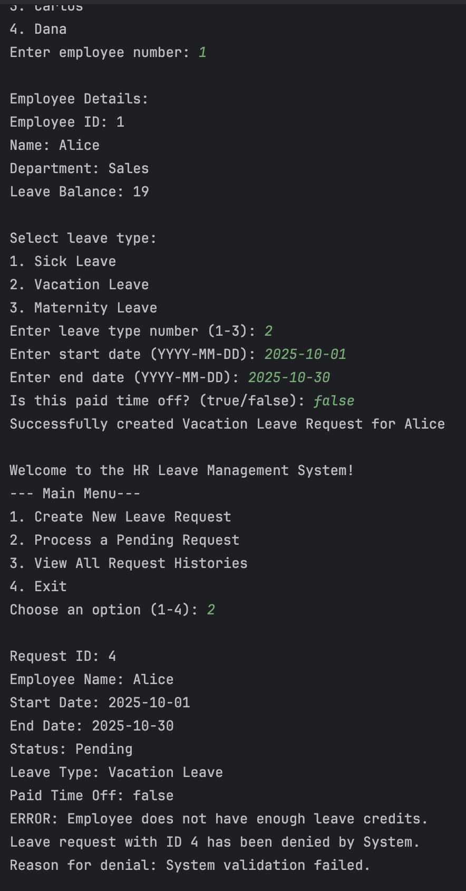

# TU-SWE: Leave Tracking System (Lab 2)
by Lorene Uy

This is a leave tracking system for employees.

These are the functionalities of the leave tracking system:
1. Create a Leave for a specific employee

2. Approve Leaves

3. View All Request Histories

Approved Leaves will automatically be deducted from an employee's leave balance.

4. Deny Leaves

Leaves may also be automatically denied by the system due to various reasons.
- No medical certificate for Sick Leaves that are more than 2 days

- Not enough leave credits left

5. Exit
